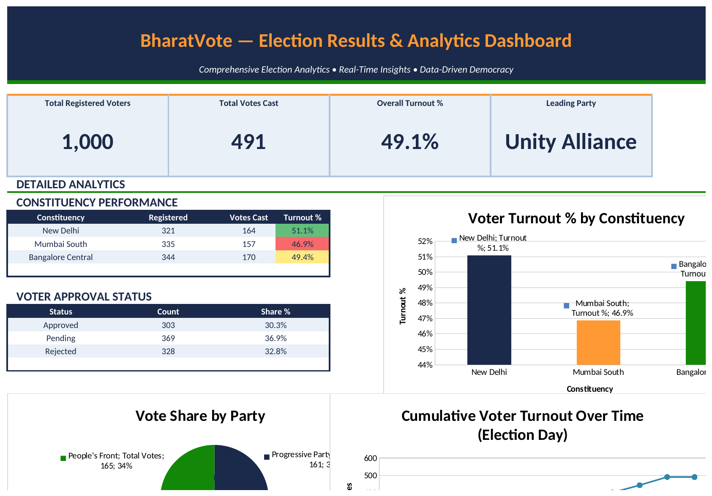
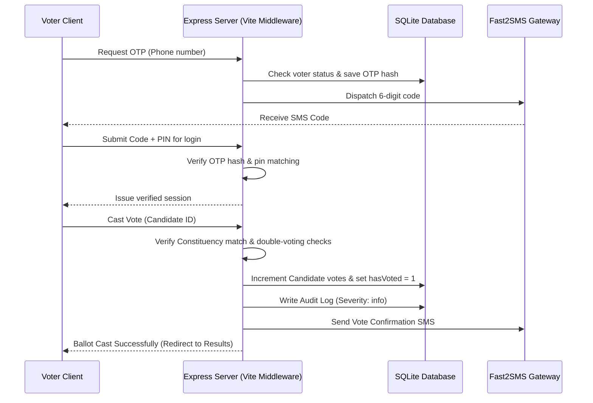

# 🇮🇳 BharatVote (भारतवोट) — Secure Digital India Online Voting System

[](https://react.dev/)
[](https://vite.dev/)
[](https://expressjs.com/)
[](https://www.sqlite.org/)
[](https://deepmind.google/technologies/gemini/)

BharatVote is a secure, modern, full-stack digital voting application tailored for Indian election environments. It provides secure voter verification using OTPs, constituency-locked voting to ensure ballot integrity, real-time audit logging for fraud prevention, and an interactive AI election assistant powered by Google Gemini.

---

## 🔗 Live Demo
Check out the live deployment of BharatVote:
👉 **[Launch BharatVote Live Demo](https://online-vs.vercel.app/)** 👈

---

## ✨ Key Features

### 👥 Citizen & Voter Experience
* **EPIC-Based Onboarding**: Register securely with a unique Election Photo Identity Card (EPIC) number, phone, and constituency.
* **OTP-Verified Authentication**: Custom 6-digit OTP delivery (via Fast2SMS gateway, fallback to console logs in development) to authenticate voter registration and login.
* **Constituency-Locked Ballots**: Voters can only view and vote for candidates running in their designated constituency.
* **Double-Voting Prevention**: System locks the voter's status (`hasVoted = 1`) immediately upon casting a vote, enforcing a strict "one voter, one vote" rule.

### 👮 Election Officials (Admin Dashboard)
* **Voter Moderation**: Review, approve, or disable voter applications before they can cast a ballot.
* **Candidate Management**: Complete CRUD operations to add, edit, or delete candidates with manifestos, party names, and emojis for symbols.
* **Election Window Controls**: Schedule active voting windows (Start/End times) and toggle results publication.
* **Real-Time Audit Log**: Dynamic log viewer categorized by severity (`info`, `warning`, `critical`) to monitor system actions and trace suspicious activities (e.g. cross-constituency voting attempts).

### 🤖 AI Election Assistant (BharatVote Buddy)
* **Constitutional Rights Guidance**: Powered by Gemini AI (`gemini-3-flash-preview`), answers voter queries about voting rights (Articles 324-329 of the Constitution) and electoral procedures.
* **Search-Grounded Citations**: Automatically uses search capabilities to cite official Election Commission of India (ECI) guidelines and resources.

---

## 📊 Analytics Dashboard

A data-analyst-style **Election Results & Analytics Dashboard** built to translate raw voter and ballot data into clear, actionable insights — designed to mirror the kind of results reporting an election commission would use internally.

**Highlights:**
* **Formula-driven KPI cards** — Total Registered Voters, Total Votes Cast, Overall Turnout %, and Leading Party, all computed live from the underlying voter dataset (no hardcoded numbers).
* **Constituency Performance table** with a red-yellow-green conditional formatting scale to instantly flag low vs. high turnout areas.
* **Voter Approval Status breakdown** (Approved / Pending / Rejected) tracking the moderation pipeline.
* **Three visualizations**: a bar chart of turnout % by constituency, a pie chart of vote share by party, and a line chart of cumulative turnout across election-day hours.
* **Auto-generated Key Insights** — plain-language summary sentences (e.g. highest/lowest turnout, leading party, approval split) that recompute automatically as the data changes.



📁 **[Download the Dashboard (.xlsx)](./docs/BharatVote_Dashboard_v2.xlsx)**

> Built in Excel using `SUMIFS`/`COUNTIFS`-based formulas and conditional formatting — every figure recalculates automatically if the underlying voter data is updated.

---

## 🏗️ Architecture & Data Flow

### Flow of a Secure Vote


### Database Schemas (SQLite)
* **`voters`**: Stores voter registration details, SHA-256 hashed PINs, verification states, and status (`PENDING`, `APPROVED`, `DISABLED`).
* **`candidates`**: Stores candidate names, parties, constituencies, custom symbols, and voting counts.
* **`elections`**: Details active elections, schedule windows, and results publication flags.
* **`otp_requests`**: Temporary table storing hashed OTPs, attempt limits, and expiry dates to block brute-force attempts.
* **`audit_logs`**: Tracks operations with details and severity.

---

## 🚀 Local Setup & Installation

### Prerequisites
* [Node.js](https://nodejs.org/) (v18 or higher recommended)
* NPM (comes packaged with Node)

### Step-by-Step Guide
1. **Clone the Repository**
   ```bash
   git clone https://github.com/your-username/bharatvote.git
   cd bharatvote
   ```

2. **Install Dependencies**
   ```bash
   npm install
   ```

3. **Configure Environment Variables**
   Create a `.env` file in the root directory and copy the contents from `.env.example`:
   ```bash
   cp .env.example .env
   ```
   Fill in your configuration details inside `.env`:
   ```env
   NODE_ENV=development
   PORT=3001
   GEMINI_API_KEY=your_gemini_api_key_here
   FAST2SMS_API_KEY=your_fast2sms_api_key_here
   APP_NAME=BharatVote
   ```

4. **Launch the Application**
   Run the full-stack server (includes Vite client middleware in development mode):
   ```bash
   npm run dev
   ```
   Open [http://localhost:3001](http://localhost:3001) in your browser.

---

## 🔒 Security & Fraud Controls
* **Rate Limiting**: Protects against verification fraud (limits to 5 OTP requests and 10 verification attempts per 15-minute window).
* **PIN Encryption**: PINs are hashed using cryptographic SHA-256 before database insertion.
* **Cross-Constituency Block**: The server automatically rejects ballots if a voter attempts to vote for a candidate outside their constituency, marking the event as a critical fraud alert (`VOTE_FRAUD_ATTEMPT`).
* **Anti-Brute Force OTP**: The system locks and expires OTPs after 5 failed attempts or 5 minutes of validity.

---

## 🔑 Default Admin Account
To log in as the default administrator and manage the candidates, elections, or voter list:
* **Username**: `official_admin`
* **Password**: `Pass123!@#`

---

## 📝 License & Disclaimer
This project is built for educational and demonstration purposes. In production environments, ensure additional authentication layers, database encryption, and secure HTTPS channels are configured.
